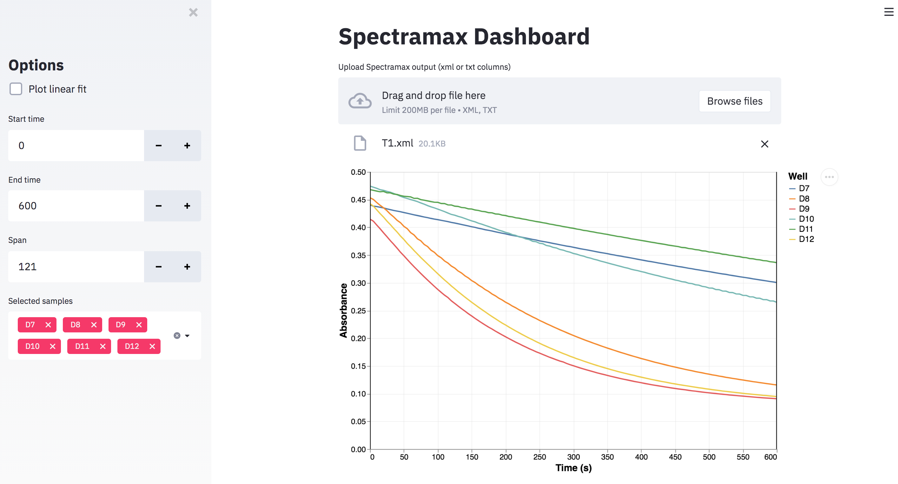
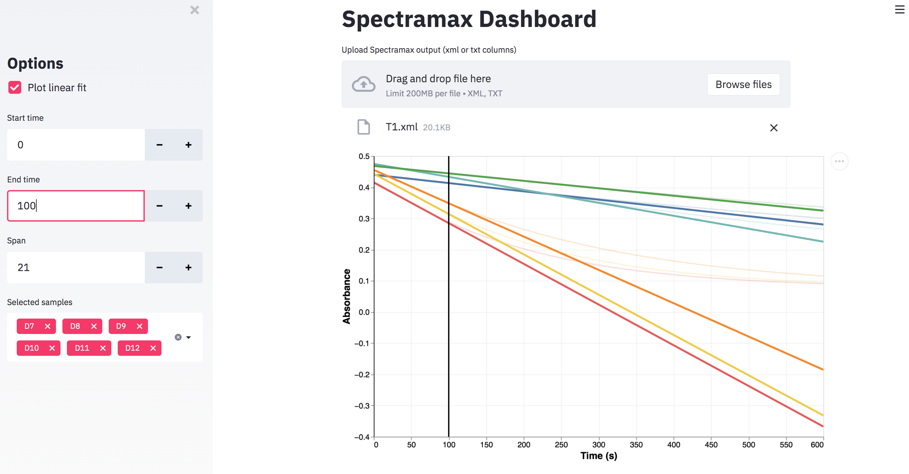
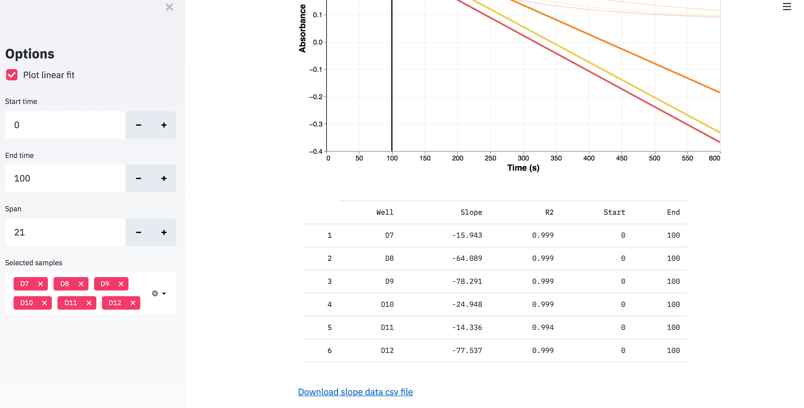

# Spectramax Dashboard

Plot softmax spectrophotometer traces from raw XML or column TXT format. Calculate slopes over selected time intervals.

## Example

```
streamlit run main.py
```

Toy data is provided in the `test_input` folder. 

#### 1. Viewing traces

Upload softmax data to start interactive plot. Click and drag to translate, double click anywhere to reset, click on the legend to mute selected traces (remove entirely with the box selector  in the sidebar), use mousewheel to zoom.



#### 2. Plot linear fit

Mark the linear fit checkbox and choose the time interval for linear regression.



#### 3. Export slope data

Dataframe with correlation and slopes measuring the changes in absorbance over time is listed on the bottom, this data can be exported in csv format.


